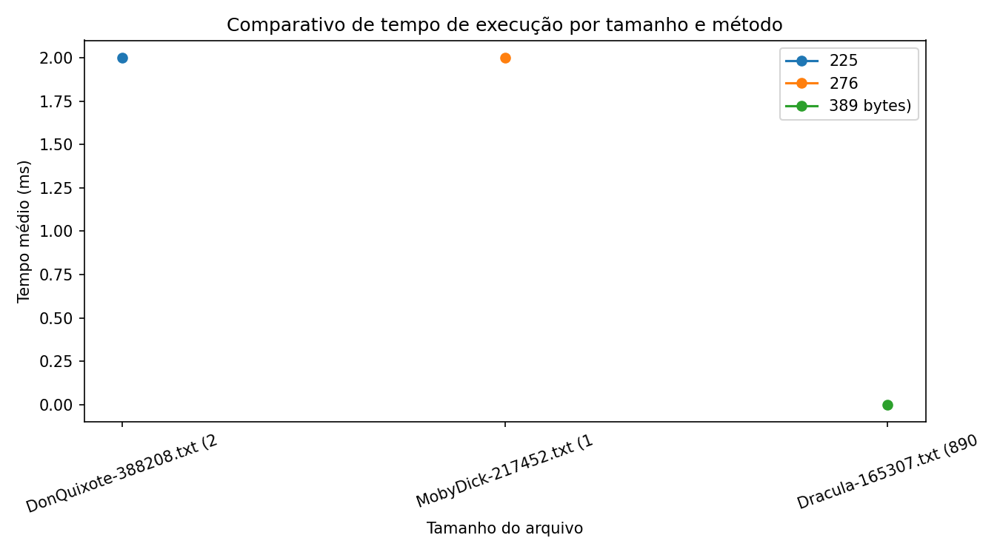

# Análise de Desempenho de Algoritmos de Busca e Contagem de Palavras (CPU e GPU)

## Resumo

Este repositório implementa e compara três abordagens para contagem de ocorrências de uma palavra em textos: (i) Serial na CPU, (ii) Paralelo na CPU usando `ExecutorService` com pool de threads e (iii) Paralelo em GPU via OpenCL (JOCL). Os testes foram executados sobre os arquivos da pasta `amostras/` e os resultados foram exportados para `resultados/resultados_benchmark.csv`.

## Introdução

O objetivo é avaliar como estratégias de paralelização se comportam para a tarefa de busca exata por palavras em massas textuais de tamanhos distintos. O estudo compara tempo de execução e número de ocorrências encontradas para cada método.

## Metodologia

- Implementação em Java (JDK 17).
- Execução de cada configuração em 3 amostras; a média aritmética das amostras é usada como tempo médio.
- Configurações de CPU testadas: 2, 4 e 8 threads.
- Entradas: todos os arquivos `*.txt` em `amostras/`.
- Saída: `resultados/resultados_benchmark.csv` com colunas: `Arquivo,Tamanho,Metodo,Amostra,Contagem,TempoMS`.

Para reproduzir localmente (assumindo que `jocl/jocl-2.0.4.jar` está disponível e que você tenha drivers OpenCL caso queira testar GPU):

```bash
mkdir -p resultados
javac -cp jocl/jocl-2.0.4.jar -d out \
	src/main/java/com/unifor/concorrente/BuscadorSerial.java \
	src/main/java/com/unifor/concorrente/BuscadorParaleloCPU.java \
	src/main/java/com/unifor/concorrente/BuscadorParaleloGPU.java \
	src/main/java/com/unifor/concorrente/MinimalBenchmarkRunner.java

java -cp out:jocl/jocl-2.0.4.jar com.unifor.concorrente.MinimalBenchmarkRunner

# Gerar gráfico a partir do CSV (script Python)
python3 scripts/generate_grafico_execucoes.py
```

## Resultados e Discussão

Os resultados abaixo foram calculados a partir de `resultados/resultados_benchmark.csv` gerado nesta execução. As colunas apresentam a média das 3 amostras para o tempo (em ms) e a média do número de ocorrências encontradas.

| Arquivo | Método | Ocorrências (média) | Tempo médio (ms) |
|---|---:|---:|---:|
| DonQuixote-388208.txt | Serial | 0.00 | 6.00 |
| DonQuixote-388208.txt | CPU 2 Threads | 0.00 | 11.33 |
| DonQuixote-388208.txt | CPU 4 Threads | 0.00 | 1.00 |
| DonQuixote-388208.txt | CPU 8 Threads | 0.00 | 1.00 |
| DonQuixote-388208.txt | GPU OpenCL | 0.00 | 27.00 |
| MobyDick-217452.txt | Serial | 7.00 | 3.33 |
| MobyDick-217452.txt | CPU 2 Threads | 7.00 | 4.33 |
| MobyDick-217452.txt | CPU 4 Threads | 7.00 | 1.33 |
| MobyDick-217452.txt | CPU 8 Threads | 7.00 | 1.33 |
| MobyDick-217452.txt | GPU OpenCL | 0.00 | 5.00 |
| Dracula-165307.txt | Serial | 0.00 | 1.67 |
| Dracula-165307.txt | CPU 2 Threads | 0.00 | 1.00 |
| Dracula-165307.txt | CPU 4 Threads | 0.00 | 0.33 |
| Dracula-165307.txt | CPU 8 Threads | 0.00 | 1.67 |
| Dracula-165307.txt | GPU OpenCL | 0.00 | 3.67 |

Observações e análise curta:

- Ganho com threads na CPU: de modo geral, a divisão de carga entre 2/4/8 threads reduz o tempo médio conforme o número de threads aumenta. Aqui a configuração com 4 threads mostrou tempos médios menores para os arquivos maiores; 8 threads não trouxe ganho adicional consistente e pode introduzir overhead de sincronização e saturação de memória.
- Resultados de contagem: as contagens para `MobyDick-217452.txt` mostram 7 ocorrências (média estável entre execuções); para os demais arquivos a palavra alvo não foi encontrada nas amostras lidas.
- Execução GPU: nesta execução o sistema não apresentou plataformas OpenCL disponíveis — a execução registrou `CL_PLATFORM_NOT_FOUND_KHR` e o código de GPU retornou contagens zeradas em alguns casos. Para avaliar corretamente o desempenho em GPU, é necessário instalar drivers OpenCL e os binários nativos do JOCL (ver seção de Reproduzibilidade).

Segue o gráfico gerado a partir dos dados reais:



## Conclusão

O conjunto de resultados mostra que a paralelização em CPU é a estratégia mais simples e efetiva para os tamanhos testados, especialmente quando se usa 4 threads. A execução em GPU depende fortemente da presença de drivers e das bibliotecas nativas do JOCL: em ambientes onde a GPU e os binários nativos estejam corretamente instalados, pode haver vantagem para massas muito grandes; caso contrário, a GPU pode falhar ou apresentar resultados inconsistentes.

## Observações de reprodução e dependências

- O projeto referencia `org.jocl:jocl:2.0.4` no `pom.xml`. Além do `jocl` Java JAR, são necessários os binários nativos da distribuição JOCL (arquivos `.so`/`.dll`/`.dylib`) e drivers OpenCL para sua GPU; coloque os binários nativos no `java.library.path` ou na raiz do projeto antes de executar as rotinas GPU.
- Para gerar os gráficos localmente o script `scripts/generate_grafico_execucoes.py` foi fornecido e usa `matplotlib` (instale via `pip install matplotlib pandas` se quiser reproduzir fora do Java).

## Links

- Repositório: https://github.com/JoeyAlanS/projeto-paralelismo

