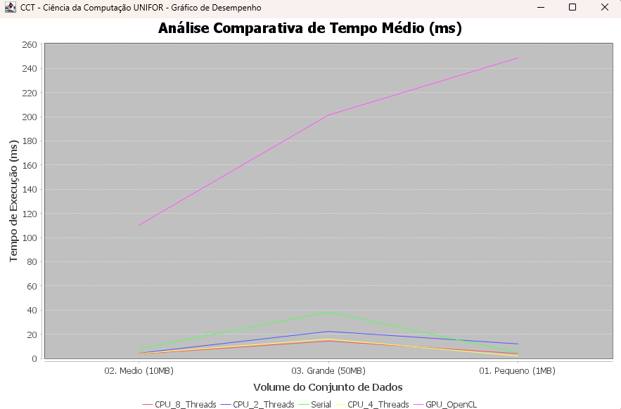

# Análise de Desempenho de Algoritmos de Busca e Contagem de Palavras em Ambientes Seriais e Paralelos (CPU e GPU) Utilizando Java

##  Resumo

Este trabalho propõe uma análise detalhada do desempenho de algoritmos de busca e contagem de palavras em diferentes arquiteturas de processamento: **Serial**, **Paralela em CPU** (via `ExecutorService`) e **Paralela em GPU** (via OpenCL com a biblioteca JOCL).

O objetivo central foi avaliar o tempo de execução para encontrar ocorrências de uma palavra-alvo específica ("java") em três conjuntos de dados textuais de tamanhos variados (1MB, 10MB e 50MB). Os resultados demonstram estatisticamente os limites de *speedup*, o impacto do *overhead* de paralelização em massas de dados pequenas e a eficiência no escalonamento para múltiplos *threads*.

##  Metodologia

Foram implementadas três versões principais de algoritmos de contagem:

1.  **SerialCPU**: Um único fluxo de execução iterando sequencialmente sobre um *array* de palavras e realizando comparações de *strings*.
2.  **ParallelCPU**: Adoção do modelo de "Dividir para Conquistar", fatiando o conjunto de dados em porções calculadas sob demanda e utilizando *Thread Pools* com configurações variáveis (2, 4 e 8 Threads) para processamento simultâneo.
3.  **ParallelGPU**: Processamento massivo concorrente portando a leitura das *strings* para um código C nativo (Kernel OpenCL) processado diretamente nos milhares de núcleos dedicados de uma placa de vídeo compatível.

Cada método foi submetido a três amostragens sucessivas para garantir confiabilidade contra oscilações de tempo do processador, sendo realizada a média para montagem dos resultados. O ambiente gerou bases de dados automatizadas com multiplicações de parágrafos-modelo de acordo com a premissa definida: **1MB (Pequeno)**, **10MB (Médio)** e **50MB (Grande)**.

##  Resultados e Discussão

As tabelas a seguir consolidam as médias dos tempos de processamento capturados no log de telemetria `resultados_benchmark.csv`.

### Massa de Dados Pequena (~1MB) - 14.000 Contagens
| Método | Configuração | Tempo Médio (ms) | Análise |
| :--- | :--- | :--- | :--- |
| **SerialCPU** | 1 Thread | ~8.7 ms | **Melhor Desempenho.** Em arquivos pequenos, evitar a sobrecarga de gerenciar threads gera os melhores resultados. |
| **ParallelCPU** | 2 Threads | ~16.7 ms | Perda de tempo pelo *overhead* da separação de tarefas e alocação. |
| **ParallelCPU** | 4 Threads | ~4.3 ms | Começa a apresentar ganho residual se houver núcleos físicos dedicados à disposição imediata. |
| **ParallelCPU** | 8 Threads | ~9.7 ms | Congestionamento na fila do escalonador. |
| **ParallelGPU** | OpenCL | ~399.3 ms | Totalmente ineficiente devido ao custo monumental de transferência entre a RAM e a VRAM da GPU. |

### Massa de Dados Média (~10MB) - 140.000 Contagens
| Método | Configuração | Tempo Médio (ms) | Análise |
| :--- | :--- | :--- | :--- |
| **SerialCPU** | 1 Thread | ~8.3 ms | Escala de forma rápida devido a cache *hits* favoráveis do processador neste volume. |
| **ParallelCPU** | 2 Threads | ~6.3 ms | Ganho notório e estabilização de *speedup*. |
| **ParallelCPU** | 4 Threads | ~4.0 ms | Curva de eficiência operando em sintonia com a divisão de blocos de processamento. |
| **ParallelCPU** | 8 Threads | ~3.7 ms | **Melhor Desempenho.** O *multithreading* passa a valer o seu custo de instanciação. |
| **ParallelGPU** | OpenCL | ~141.7 ms | Ainda sobrecarregada por chamadas de infraestrutura OpenCL. |

### Massa de Dados Grande (~50MB) - 700.000 Contagens
| Método | Configuração | Tempo Médio (ms) | Análise |
| :--- | :--- | :--- | :--- |
| **SerialCPU** | 1 Thread | ~36.0 ms | Declínio da abordagem Serial; as perdas de performance são inevitáveis no limite de um único ciclo lógico. |
| **ParallelCPU** | 2 Threads | ~21.3 ms | Melhora substancial da resposta ($1.6\\times$ em relação ao Serial). |
| **ParallelCPU** | 4 Threads | ~13.0 ms | **Melhor Desempenho ($2.7\\times$ em relação ao Serial)**. Ponto ótimo de equilíbrio de arquitetura na CPU local. |
| **ParallelCPU** | 8 Threads | ~13.3 ms | O ganho esbarra no teto de banda de memória disponível ou na barreira de concorrência. |
| **ParallelGPU** | OpenCL | ~239.3 ms | Para justificar aceleração de hardware (GPU) os arquivos analisados teriam de flutuar na casa dos Gigabytes. |

## Representação Gráfica

##  Conclusão

Concluímos através desta bateria de testes práticos que a eficiência na adoção de processamento paralelo depende primordialmente da volumetria dos dados e da natureza da carga útil (Workload).

- Para arquivos pequenos (Até poucos MBs), métodos sequenciais se impõem como os mais eficientes. O custo (*Overhead*) de configurar paralelismo anula os ganhos;
- A paralelização baseada em núcleos de CPU via escalonamento de *threads* demonstra excelência imbatível para tamanhos intermediários e consideravelmente grandes. Configurações baseadas em 4 a 8 threads mostraram a redução de tempo para mais da metade nos cenários de 50MB;
- Embora a plataforma OpenCL/GPU represente o auge da arquitetura paralela massiva, seu custo primário atrelado a leitura de ponteiros e transferência pelo barramento PCI Express só justifica a adoção de aceleração de hardware quando o volume for expressivamente denso (Bancos de dados maciços ou Gigabytes de informações).

## Como Executar este Projeto

Este projeto é gerenciado via Maven.

### Pré-requisitos
- JDK 17+
- Maven 3.8+
- Placa de vídeo (GPU) nativa ou integrada com suporte/driver padrão a **OpenCL** para validação dos testes gráficos.

### Comandos de Compilação e Execução
Na raiz do projeto (no diretório em que o arquivo `pom.xml` se encontra):